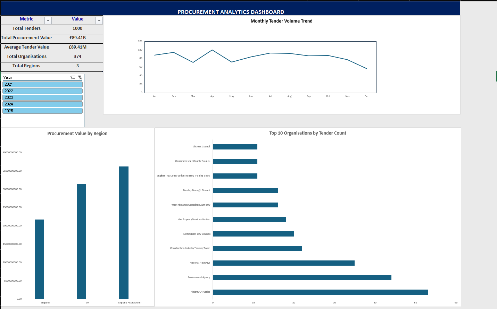

# Procurement Analytics Dashboard (Excel)

## Project Overview

This project analyzes procurement tender data using Microsoft Excel and provides insights into procurement activity, spending patterns, regional distribution, and top organizations through an interactive dashboard.

## Dashboard Features

- KPI Cards
- Monthly Tender Trend Analysis
- Top Organizations Analysis
- Regional Procurement Value Analysis
- Interactive Year Slicer
- Professional Dashboard Design

## Tools Used

- Microsoft Excel
- Pivot Tables
- Pivot Charts
- Slicers
- Data Visualization

## Dashboard Preview

